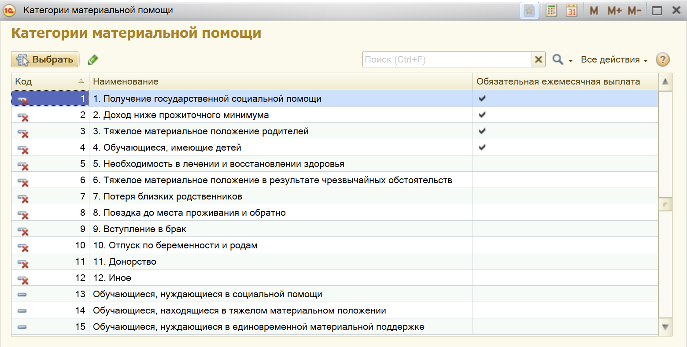
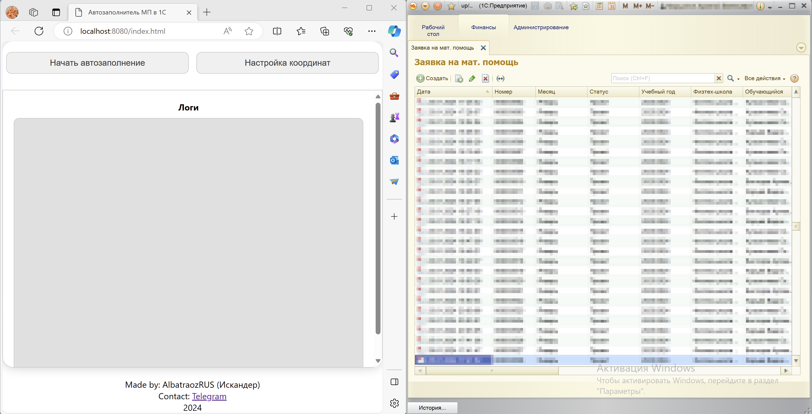

# MP_to_1C (Автозаполнитель МП в 1C)
- [MP\_to\_1C (Автозаполнитель МП в 1C)](#mp_to_1c-автозаполнитель-мп-в-1c)
  - [Описание](#описание)
  - [Важные моменты перед установкой](#важные-моменты-перед-установкой)
  - [Использование](#использование)
  - [Сборка приложения для Windows](#сборка-приложения-для-windows)

## Описание
Данная программа предназначена для упрощения ввода в систему 1С данных по материальной помощи и с помощью эмулирования компьютерной мыши и клавиатуры делает это самостоятельно. Для удобства используется web-интерфейс, расположенный на `localhost:8080`. Приложение распространяется в виде одного исполняемого файла `MP_to_1C.exe`, который собирается с использованием библиотеки `pyinstaller`.

## Важные моменты перед установкой

1. Если у вас не установлена необходимая версия 1C, то вы можете сделать это по этой [ссылке](https://drive.google.com/file/d/1dFQWBLDxfwtiYzuN52BIOyhC7CEi0OFc/view?usp=sharing). Также у вас должен быть установлен браузер Edge.

2. Порядок категорий материальной помощи в 1C должен быть отсортирован по его коду в порядке возрастания, как это изображено тут: 

3. Требования к таблице:
   1.  Таблица с материальной помощью должна иметь следующие поля:
          - ФИО
          - Сумма
          - Категория (одна из трех ниже)
            - Обучающиеся, нуждающиеся в социальной помощи
            - Обучающиеся, находящиеся в тяжелом материальном положении
            - Обучающиеся, нуждающиеся в единовременной материальной поддержке
  
   2. Лист должен называться `Лист1`

   3. Пример таблицы с материальной помощью: 

## Использование
1. Запустить приложение `MP_to_1C.exe` от **имени администратора**.
2. Открыть окно 1C с заполнением материальной помощи.
3. Расположить окна в следующем формате

4. Выполнить настройку координат с помощью соответствующей кнопки.
5. Нажать на кнопку `Начать заполнение`
6. В поле ввода вставить полный путь до таблицы с материальной помощью.
7. После каждой заполненной заявки программа останавливается и ждет нажатия клавиши `Правый Shift` для продолжения заполнения.
8. В случае если во время заполнения заявок возникла ошибка, то вручную заполните данную заявку, используя информацию отображаемую в поле `Логи`, затем откройте окно для новой заявки и нажмите `Правый Shift`.

## Сборка приложения для Windows
1. Перейти в папку с проектом
2. Создать виртуальное окружение
```bash
python -m venv env
```
3. Перейти в виртуальное окружение
```bash
env\Scripts\activate
```
4. Установить зависимости
```bash
pip install -r requirements.txt
```
5. Собрать приложение
```bash
python -m eel .\app.py .\web\ --noconsole \ # Выключить консоль
                              --onefile \ # Запаковать приложения в один файл
                              --icon=icon.ico \ # Иконка приложения
                              --name="MP_to_1C" \ # Название приложения
                              --add-data .\templates\:.\templates\ \ # Использование необходимых изображений
                              --add-data .\drive_token.json:. \ # Использование токена для доступа к Google Drive
```
6. После завершения сборки в папке `dist` появится файл `MP_to_1C.exe`.